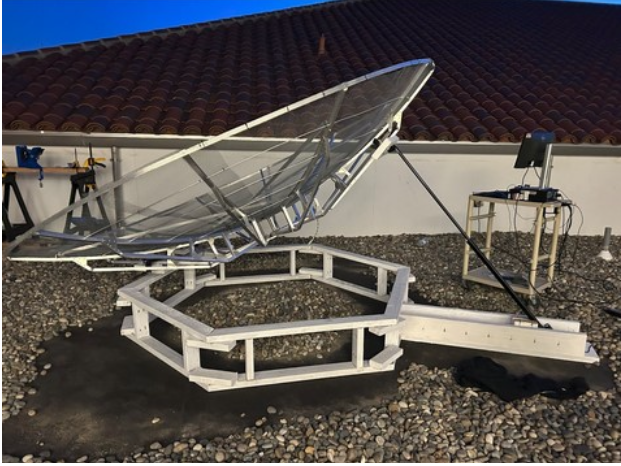

# SCRAP - Santa Clara Radio Astronomy Project

SCRAP is a motorized radio telescope positioning system developed as a student-led project through the Electromagnetics Lab at Santa Clara University. The system provides precise angular positioning of a radio telescope dish via Arduino-controlled motor hardware and real-time angle sensor feedback.

**Authors:** Peter Lattimer and Nick Alva (2025)

## Overview

The system uses a closed-loop control approach: a Python program reads the current dish angle from a serial IMU sensor, compares it to a user-specified target angle, and drives a motor forward or backward until the target is reached. Angle and time data are logged during each positioning operation and exported to MATLAB format for post-processing and analysis.

## Hardware Requirements


- **Rotation Module** 
- **Arduino-compatible microcontroller** (connected via USB, running Firmata firmware)
- **Serial angle sensor / IMU**


### Pin Assignments

| Pin | Function |
|-----|----------|
| D2  | Yellow LED (reverse indicator) |
| D3  | Blue LED (data acquisition indicator) |
| D4  | Red LED (stop indicator) |
| D5  | Green LED (forward indicator) |
| D9  | Speaker / buzzer |
| D10 | Reverse Motor Bias (PWM) |
| D11 | Forward Motor Bias (PWM) |

## Software Dependencies

- Python 3
- [pyfirmata2](https://pypi.org/project/pyFirmata2/) - Arduino Firmata protocol communication
- [pyserial](https://pypi.org/project/pyserial/) - Serial port communication
- [numpy](https://pypi.org/project/numpy/) - Numerical array operations
- [scipy](https://pypi.org/project/scipy/) - MATLAB `.mat` file export

Install dependencies:

```bash
pip install pyfirmata2 pyserial numpy scipy
```

## Configuration

Before running, update the serial port constants in `main.py` to match your system:

```python
arduino_port = 'COM3'   # Arduino board port
sensor_port  = 'COM6'   # Angle sensor port
```

The `normalization_factor` variable calibrates the sensor's raw angle output to the physical resting position of the dish. Adjust this value (typically 203-206) based on your hardware setup.

## Usage

1. Connect the Arduino and angle sensor via USB.
2. Flash the Arduino with StandardFirmata firmware.
3. Run the program:

```bash
python main.py
```

4. Enter the desired angle when prompted. The system will rotate the dish to that position, providing LED and audio feedback throughout.

## Output

Each positioning operation saves an `arrays.mat` file in the working directory containing:

- `angle_array` - Angle measurements recorded during movement
- `time_array` - Corresponding elapsed timestamps

These arrays can be analyzed with the included MATLAB scripts.

## MATLAB Analysis Scripts

- **AngleTimePlotter.m** - Plots the dish angle trajectory over time with target angle bands (+/-2 degrees).
- **AngleComparison.m** - Compares sensor readings against manual protractor measurements for calibration validation.

## Project Structure

```
├── main.py                 # Main control program
├── AngleComparison.m       # MATLAB calibration validation script
├── AngleTimePlotter.m      # MATLAB trajectory analysis script
├── SCRAP Thesis.pdf        # Project thesis document
├── LICENSE                 # MIT License
└── README.md
```

## License

MIT License - see [LICENSE](LICENSE) for details.
